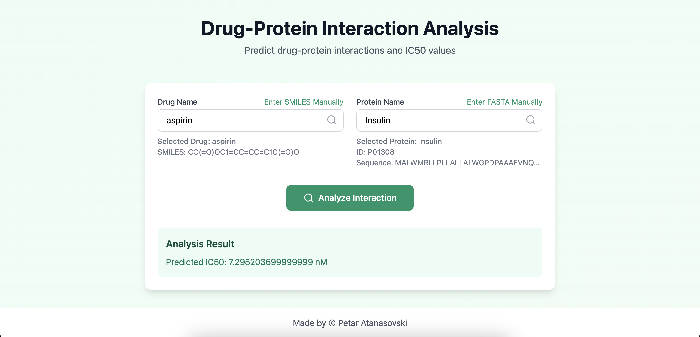

# Drug-Protein Interaction Prediction

This project provides a tool for predicting drug-protein interactions and IC50 values using machine learning techniques. The system consists of three main parts:

- **Frontend (React App)**: A user interface to input drug and protein names manually or through SMILES and FASTA sequences.
- **Backend (FastAPI)**: A Python backend that processes the data and interacts with the trained machine learning model to predict drug-protein affinities.
- **Model Training (drug_target_affinity.ipynb)**: A notebook where the model training process is visualized and explained in detail.

The model uses **Random Forest Regressor** to predict the binding affinity between a drug and its target protein, based on their SMILES and FASTA representations. The backend integrates with the **BindingDB IC50 dataset** to provide real-time validation of known interactions, while also predicting new interactions for unseen drug-protein pairs.

## Research Paper

A detailed explanation of the project, including methodology, results, and discussion, can be found in the research paper. You can download it [here](link-to-your-research-paper.pdf).

## Installation Instructions

### Prerequisites
Ensure you have Python 3.11 and Node.js installed on your machine.

### Backend Setup (FastAPI)
1. Navigate to the backend directory.
2. Create a virtual environment and activate it:
   ```bash
   python -m venv venv
   source venv/bin/activate   # For Linux/macOS
   venv\Scriptsctivate      # For Windows
   ```
3. Install the required Python dependencies:
   ```bash
   pip install -r requirements.txt
   ```
4. Start the FastAPI backend server:
   ```bash
   python -m uvicorn main:app --reload
   ```
   This will start the server at `http://localhost:8000`.

### Frontend Setup (React App)
1. Navigate to the frontend directory.
2. Install the necessary JavaScript dependencies:
   ```bash
   npm install
   ```
3. Start the React development server:
   ```bash
   npm run dev
   ```
   This will start the frontend at `http://localhost:5173`.

### Running the Application
- Once both the backend and frontend are running, you can open the web app in your browser.
- Enter a drug name and protein name (either by typing or entering SMILES and FASTA data), then click the "Analyze Interaction" button to get the predicted binding affinity.

### Model Training and Exploration
The **.ipynb** file contains the code used for training the Random Forest model. It includes data preprocessing, feature extraction, and the training pipeline, as well as evaluation of the model performance.

### Example Usage of the Backend API
To use the backend API directly, you can send a POST request to `http://localhost:8000/predict` with the following JSON body:
```json
{
  "drug": "SMILES-or-DrugName",
  "protein": "FASTA-or-ProteinName"
}
```
The response will include the predicted affinity:
```json
{
  "predicted_affinity": <value>
}
```

## Acknowledgments
- **FastAPI** for building the backend.
- **React** for creating the frontend.
- **RDKit** and **Biopython** for handling SMILES and FASTA data.
- **TDC (The Drug Response Database)** for providing the dataset.
